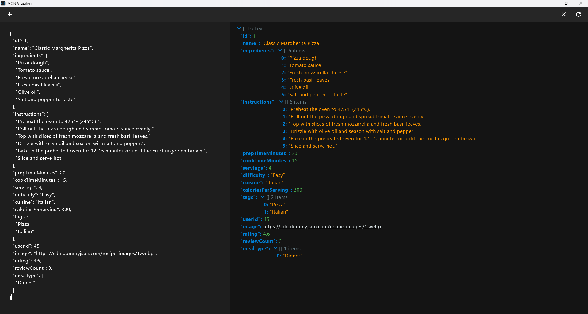

# JSON Visualizer
A cross-platform desktop application for visualizing and exploring JSON data built with Compose Desktop.


## Features
- **Dual-pane Interface**: View raw JSON on the left, structured visualization on the right
- **Collapsible Tree View**: Easily expand/collapse nested JSON structures
- **Syntax Highlighting**: Color-coded display for improved readability
- **Cross-platform**: Works on Windows, macOS, and Linux
- **Simple Interface**: Clean, intuitive UI
## Installation
### Building for Each Platform

#### Windows
```bash
# Clone the repository
git clone https://github.com/Abhay-cloud/JsonVisualizer.git
cd JsonVisualizer

# Build Windows executable
./gradlew packageMsi   # Creates MSI installer
# OR
./gradlew packageExe   # Creates EXE installer
```

#### macOS
```bash
# Clone the repository
git clone https://github.com/Abhay-cloud/JsonVisualizer.git
cd JsonVisualizer

# Build macOS application
./gradlew packageDmg   # Creates DMG installer
# OR
./gradlew packageMacOS # Creates .app bundle
```

#### Linux
```bash
# Clone the repository
git clone https://github.com/Abhay-cloud/JsonVisualizer.git
cd JsonVisualizer

# Build Linux packages
./gradlew packageDeb   # Creates DEB package for Debian-based distributions
# OR
./gradlew packageRpm   # Creates RPM package for Red Hat-based distributions
# OR
./gradlew packageAppImage # Creates AppImage
```

## Usage
1. Launch the application
2. Use the "+" button to create a new document or open an existing JSON file
3. Edit JSON in the left pane or paste JSON content
4. View the structured representation in the right pane
5. Expand/collapse nodes using the arrow icons
6. Format/prettify the JSON in the left pane using the format button or press `Ctrl + L`
## Building from Source
### Build Steps
```bash
# Clone the repository
git clone https://github.com/Abhay-cloud/JsonVisualizer.git
cd JsonVisualizer
# Build with Gradle
./gradlew build
# Run the application
./gradlew run
```
## Contributing
Contributions are welcome! Please feel free to submit a Pull Request.
1. Fork the repository
2. Create your feature branch (`git checkout -b feature/amazing-feature`)
3. Commit your changes (`git commit -m 'Add some amazing feature'`)
4. Push to the branch (`git push origin feature/amazing-feature`)
5. Open a Pull Request
## License
This project is licensed under the MIT License - see the [LICENSE](LICENSE) file for details.